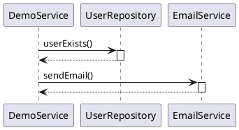

# DebuggerToUML 使用文档

## 目录
1. [插件简介](#插件简介)
2. [安装指南](#安装指南)
3. [快速开始](#快速开始)
4. [功能详解](#功能详解)
5. [配置选项](#配置选项)
6. [常见问题](#常见问题)
7. [最佳实践](#最佳实践)

## 插件简介

DebuggerToUML是一个IntelliJ IDEA插件，可以在调试过程中自动捕获方法调用栈，并生成清晰的时序图。

### 主要特性
- ✅ 自动捕获调试调用栈
- ✅ 生成PlantUML时序图
- ✅ 图形化显示调用关系
- ✅ 支持导出PNG/SVG/PDF
- ✅ 完全离线可用
- ✅ 灵活的过滤配置

## 安装指南

### 方式一：从源码构建
```bash
# 1. 克隆项目
git clone <repository-url>
cd plucky-debuggerToUML

# 2. 构建插件
./gradlew buildPlugin

# 3. 安装插件
# 在IDEA中: Settings -> Plugins -> Install Plugin from Disk
# 选择: build/distributions/plucky-debuggerToUML-1.0.0.zip
```

### 方式二：从JetBrains插件市场安装
（待发布）

## 快速开始

### 第一步：设置断点
在你想要分析的代码位置设置断点：
```java
public void registerUser(String username, String email) {
    // 在这里设置断点
    validateUserInfo(username, email);
    // ...
}
```

### 第二步：启动调试
1. 点击Debug按钮（或按Shift+F9）
2. 程序运行到断点处会暂停

### 第三步：查看时序图
1. 断点触发时，插件自动捕获调用栈
2. 在右侧打开"DebuggerToUML"工具窗口
3. 查看生成的PlantUML代码
4. 点击"渲染图表"按钮查看图形化时序图

### 第四步：导出图表
1. 点击"导出图表"按钮
2. 选择格式（PNG/SVG/PDF）
3. 选择保存位置
4. 完成导出

## 功能详解

### 1. 自动捕获调用栈

**触发条件**：
- 调试会话暂停（断点触发）
- 启用了"自动捕获"选项

**捕获内容**：
- 当前方法
- 调用链上的所有方法
- 方法所属的类
- 调用深度信息

**示例输出**：


### 2. 图表渲染

**渲染引擎**：
- 使用PlantUML的Smetana布局引擎
- 纯Java实现，完全离线可用
- 不需要外部Graphviz

**渲染过程**：
1. 解析PlantUML代码
2. 在后台线程渲染
3. 显示进度提示
4. 自动切换到图片视图

**性能优化**：
- 异步渲染避免UI冻结
- 支持大型调用栈（建议<50层）
- 内存优化处理

### 3. 导出功能

**支持格式**：
- **PNG**: 适合文档和演示
- **SVG**: 矢量图，适合缩放
- **PDF**: 适合打印和归档

**导出选项**：
```
导出图表
  ├─ 选择格式
  ├─ 选择保存位置
  ├─ 后台导出
  └─ 显示结果通知
```

### 4. 过滤功能

**JDK类过滤**：
自动过滤Java标准库的类：
- java.*
- javax.*
- sun.*
- jdk.*

**自定义过滤**：
可以配置要过滤的包名：
```
com.example.util,
org.springframework.aop,
net.sf.cglib
```

## 配置选项

### 打开配置界面
`Settings` -> `Tools` -> `DebuggerToUML Settings`

### 配置项说明

#### 1. 最大调用栈深度
- **默认值**: 10
- **范围**: 1-100
- **说明**: 限制捕获的调用栈层数
- **建议**:
  - 简单分析：5-10层
  - 详细分析：15-30层
  - 深度分析：30-50层

#### 2. 自动捕获
- **默认值**: 启用
- **说明**: 断点触发时自动捕获调用栈
- **建议**: 保持启用，除非需要手动控制

#### 3. 显示方法参数
- **默认值**: 启用
- **说明**: 在时序图中显示方法参数
- **影响**: 增加图表复杂度

#### 4. 显示返回值
- **默认值**: 禁用
- **说明**: 在时序图中显示返回值
- **影响**: 增加图表复杂度

#### 5. 显示时间戳
- **默认值**: 禁用
- **说明**: 显示方法调用的时间戳
- **用途**: 性能分析

#### 6. 过滤JDK类
- **默认值**: 启用
- **说明**: 自动过滤Java标准库
- **建议**: 保持启用，减少噪音

#### 7. 过滤的包名
- **默认值**: `java.lang,java.util,sun.`
- **格式**: 逗号分隔的包名前缀
- **示例**: `com.example.util,org.springframework`

#### 8. 图表类型
- **默认值**: plantuml
- **选项**: plantuml, graphviz
- **说明**: 目前只支持plantuml

## 常见问题

### Q1: 工具窗口没有显示
**A**:
1. 检查 `View` -> `Tool Windows` -> `DebuggerToUML`
2. 重启IDEA
3. 检查插件是否正确安装

### Q2: 没有自动捕获调用栈
**A**:
1. 检查Settings中是否启用了"自动捕获"
2. 确认断点已触发（程序暂停）
3. 查看IDEA日志是否有错误

### Q3: 渲染失败
**A**:
1. 检查PlantUML代码语法
2. 减少调用栈深度
3. 增加IDEA内存（Help -> Edit Custom VM Options）
4. 查看日志获取详细错误

### Q4: 导出失败
**A**:
1. 确保有写入权限
2. 检查磁盘空间
3. 尝试不同的导出格式
4. 查看日志获取详细错误

### Q5: 离线环境无法使用
**A**:
插件完全离线可用！如果遇到问题：
1. 确认PlantUML依赖已下载
2. 检查是否使用了Smetana引擎
3. 重新构建插件

### Q6: 调用栈为空
**A**:
1. 确认断点在有调用栈的位置
2. 检查过滤规则是否过于严格
3. 增加最大调用栈深度
4. 禁用JDK类过滤测试

### Q7: 图表太复杂
**A**:
1. 减少最大调用栈深度
2. 启用更多过滤规则
3. 在更高层的方法设置断点
4. 禁用"显示方法参数"

### Q8: 性能问题
**A**:
1. 减少调用栈深度
2. 启用过滤功能
3. 增加IDEA内存
4. 关闭不必要的插件

## 最佳实践

### 1. 分析业务流程
```java
// 在业务入口设置断点
public void processOrder(Order order) {
    // 断点设在这里
    validateOrder(order);
    calculatePrice(order);
    saveOrder(order);
    sendNotification(order);
}
```

**配置建议**：
- 最大深度：10-15
- 启用JDK过滤
- 禁用参数显示

### 2. 调试复杂问题
```java
// 在问题方法附近设置断点
public void complexMethod() {
    // 断点设在这里
    step1();
    step2();
    step3();
}
```

**配置建议**：
- 最大深度：20-30
- 启用参数显示
- 启用时间戳

### 3. 性能分析
```java
// 在性能瓶颈处设置断点
public void slowMethod() {
    // 断点设在这里
    heavyComputation();
}
```

**配置建议**：
- 最大深度：5-10
- 启用时间戳
- 禁用参数显示

### 4. 学习代码
```java
// 在不熟悉的代码设置断点
public void unknownMethod() {
    // 断点设在这里
    // 查看调用链了解代码结构
}
```

**配置建议**：
- 最大深度：15-20
- 禁用JDK过滤（查看完整调用）
- 启用参数显示

### 5. 文档生成
```java
// 为文档生成时序图
public void documentedMethod() {
    // 断点设在这里
    // 导出图表用于文档
}
```

**配置建议**：
- 最大深度：适中
- 启用过滤
- 导出为SVG（矢量图）

## 技巧和窍门

### 1. 快捷键
- 设置断点：`Ctrl+F8` (Windows/Linux) / `Cmd+F8` (Mac)
- 开始调试：`Shift+F9`
- 单步执行：`F8`
- 进入方法：`F7`

### 2. 多次捕获
可以在不同的断点捕获多次，比较不同的调用路径

### 3. 手动编辑
可以手动编辑PlantUML代码，添加注释或调整样式

### 4. 复制代码
可以复制PlantUML代码到在线编辑器（如plantuml.com）查看

### 5. 批量导出
可以捕获多个调用栈，分别导出为文件

## 故障排除

### 日志位置
IDEA日志文件位置：
- Windows: `%USERPROFILE%\.IntelliJIdea<version>\system\log\idea.log`
- Mac: `~/Library/Logs/IntelliJIdea<version>/idea.log`
- Linux: `~/.IntelliJIdea<version>/system/log/idea.log`

### 搜索关键词
在日志中搜索：
- `DebuggerToUML`
- `CallStackCapture`
- `PlantUMLRenderer`

### 报告问题
如果遇到问题，请提供：
1. IDEA版本
2. 插件版本
3. 错误日志
4. 重现步骤
5. 示例代码

## 更新日志

### Version 1.0.0 (2025-12-29)
- ✅ 初始版本发布
- ✅ 支持调试调用栈捕获
- ✅ 支持PlantUML时序图生成
- ✅ 支持图表渲染（离线）
- ✅ 支持导出PNG/SVG/PDF
- ✅ 支持配置管理
- ✅ 支持过滤功能

## 反馈和支持

- GitHub Issues: <repository-url>/issues
- Email: support@plucky.com
- 文档: <repository-url>/wiki

## 许可证

MIT License

---

感谢使用 DebuggerToUML！
