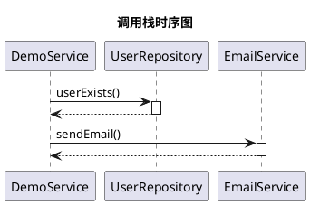

# 快速开始指南

## 🚀 5分钟快速上手

### 步骤1: 打开项目 (30秒)
```bash
# 在IntelliJ IDEA中
File -> Open -> 选择 plucky-debuggerToUML 目录
```

### 步骤2: 等待Gradle同步 (2-3分钟)
- IDEA会自动识别Gradle项目
- 自动下载Gradle wrapper
- 自动下载依赖（PlantUML、ASM等）
- 等待右下角进度条完成

### 步骤3: 运行插件 (30秒)
```bash
# 方式1: 使用Gradle任务
./gradlew runIde

# 方式2: 在IDEA中
右键 build.gradle.kts -> Run 'runIde'
```

### 步骤4: 测试插件 (1分钟)
1. 沙箱IDEA启动后
2. 打开 `test-project` 目录
3. 找到 `DemoService.java`
4. 在 `main` 方法第一行设置断点
5. Debug运行
6. 查看右侧"DebuggerToUML"工具窗口

## ✅ 验证清单

### 基本功能
- [ ] 断点触发时自动捕获调用栈
- [ ] 工具窗口显示PlantUML代码
- [ ] 点击"渲染图表"显示时序图
- [ ] 点击"导出图表"保存文件

### 配置功能
- [ ] Settings -> Tools -> DebuggerToUML Settings
- [ ] 修改调用栈深度
- [ ] 测试过滤功能
- [ ] 点击"重置到默认值"

### 离线功能
- [ ] 断开网络连接
- [ ] 重启IDEA
- [ ] 所有功能正常工作

## 🎯 预期结果

### 自动捕获
```
断点触发 → 自动捕获 → 显示通知 → 更新工具窗口
```

### PlantUML代码示例


### 时序图
应该看到一个清晰的时序图，显示：
- DemoService调用UserRepository
- DemoService调用EmailService
- 方法调用和返回的箭头
- 激活的生命线

## 🐛 常见问题

### Q: Gradle同步失败
**A**:
```bash
# 清理并重新构建
./gradlew clean
./gradlew build --refresh-dependencies
```

### Q: 插件没有启动
**A**:
- 检查IDEA日志: Help -> Show Log in Explorer
- 搜索关键词: "DebuggerToUML"
- 查看错误信息

### Q: 工具窗口没有显示
**A**:
```
View -> Tool Windows -> DebuggerToUML
```

### Q: 没有自动捕获
**A**:
1. 检查Settings中是否启用"自动捕获"
2. 确认断点已触发（程序暂停）
3. 查看IDEA日志

### Q: 渲染失败
**A**:
1. 检查PlantUML代码语法
2. 查看IDEA日志获取详细错误
3. 尝试减少调用栈深度

## 📚 更多资源

- **使用文档**: `使用文档.md` - 完整的用户手册
- **构建文档**: `项目构建文档.md` - 开发和构建指南
- **优化报告**: `项目优化完成报告.md` - 所有优化内容
- **测试说明**: `test-project/README.md` - 详细测试步骤

## 🎉 成功标志

如果你看到：
1. ✅ 断点触发时显示通知："调用栈已捕获，共 X 个方法"
2. ✅ 工具窗口显示PlantUML代码
3. ✅ 点击"渲染图表"显示时序图
4. ✅ 可以导出为PNG/SVG/PDF

**恭喜！插件运行正常！** 🎊

## 💡 下一步

1. **尝试不同的代码**
   - 在自己的项目中设置断点
   - 测试不同的调用深度
   - 尝试复杂的调用链

2. **调整配置**
   - 修改最大调用栈深度
   - 配置过滤规则
   - 测试不同的显示选项

3. **导出图表**
   - 导出为PNG用于文档
   - 导出为SVG用于演示
   - 导出为PDF用于归档

4. **反馈问题**
   - 记录遇到的问题
   - 提供复现步骤
   - 附上日志文件

---

**祝你使用愉快！** 🚀
